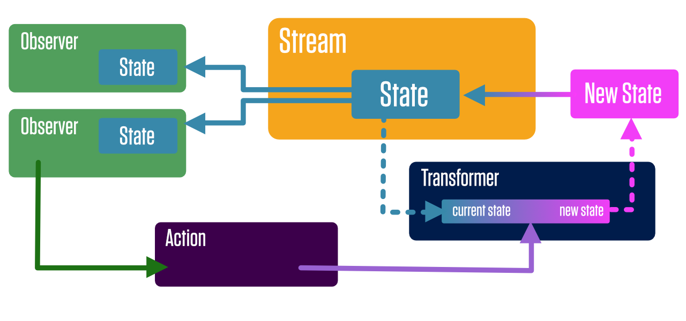
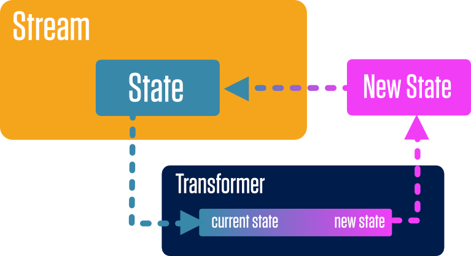
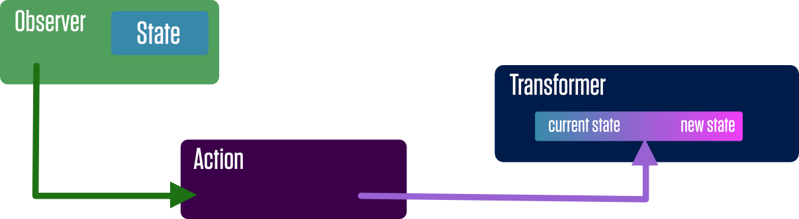

## One-Way Data Flow

### Terminology

#### State
**State** is an `Immutable` data structure that represents the data needed to render your application. This includes the state of the UI in addition to data that might be retrieved from a database or server.

#### Streams
A **Stream** is a canonical source of **state** for a part of an application. Observers can subscribe to a stream to receive new state when the stream updates. Streams in Protonic are similar to streams in other frameworks (they are actually very similar to BehaviorSubjects in RxJS), but make certain assumptions to simplify things.

1. Streams remember the last state emitted.
2. Streams won't emit falsey values.
3. Streams won't emit a new state if it's content is the same as the current state of the stream.
4. Streams don't "complete".
5. Streams make their internal state available without needing to subscribe to the stream.
6. Streams only work with immutable data.

#### Transformers
A **transformer** is a function that gets the current state of a stream, transforms the state into new state, and sends the new state back to the stream.

A transformer is *only* allowed to operate on state from one stream. It may not affect state outside of itself. Additionally, *Only* transformers are allowed to change the state of stream.

#### Actions
Since transformers are each allowed to only transform state from one stream, and are not allowed to have side-effects, **actions** are what we use to combine state changes across streams, as well as perform side-effects (such as Ajax request to fetch data from a server).

Actions are allowed to call transformers for different streams, but actions may not manipulate streams directly. Since transformers are not technically reducers (they don't receive state as an argument or return state), they cannot be batched together in on atomic state change. This means that a transform of state from one stream should not depend on a transform of state from another stream happening in a particular order.

